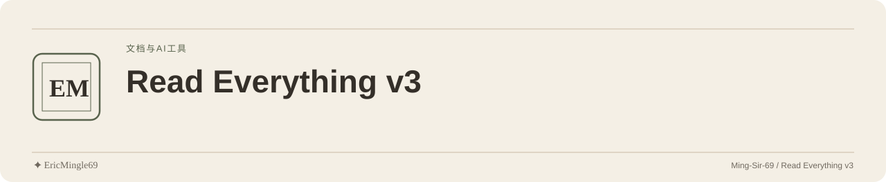

<picture>
  <source media="(prefers-color-scheme: dark)" srcset="readme-assets/header-dark.svg">
  <source media="(prefers-color-scheme: light)" srcset="readme-assets/header-light.svg">
  
</picture>

<p align="center">
  <a href="README.md">简体中文</a> · <a href="README.en.md">English</a> · <a href="PERSONAL-NOTICE.md">✦ EricMingle69</a>
</p>

# Read Everything v3

## 项目定位

按文件类型选择文档转换、视觉 OCR 或语音转写，将结果保存为输入文件旁的 Markdown，供人和 AI 阅读。

## 阅读入口

| 入口 | 内容 |
| --- | --- |
| [转换 CLI](scripts/read_everything_v3.py) | 实际文件处理与路由入口 |
| [配置模板](scripts/read_everything_config.example.json) | 云服务 Key 占位值 |
| [容器定义](Dockerfile) | Python 3.13 与 ffmpeg 环境 |
| [架构说明](references/architecture.md) | 处理路径的背景 |
| [使用边界](references/boundary-matrix.md) | 工具选择说明 |
| [AI 工作流](SKILL.md) | 输入输出与协作定义 |
| [支持说明](SUPPORT.md) | 帮助入口，配置路径见下方纠正 |
| [安全反馈](SECURITY.md) | 漏洞报告入口 |

## 从哪里开始

1. 从可信的 Office/结构化文件开始，在自己的 Python 环境准备依赖：

```sh
pip install "markitdown[all]" pypdfium2 pypdf dashscope openai requests Pillow
python3 scripts/read_everything_v3.py document.docx
```

2. 输出为 `document.docx.md`；同名结果会被覆盖，目录须可写。
3. PDF/图片分类使用 `http://localhost:11434` 的 Ollama `qwen2.5vl:7b`。云 OCR 优先 Gemini，备选 NVIDIA NIM；音频使用 DashScope ASR，失败时尝试本地 Whisper。
4. 云配置放在 `scripts/read_everything_config.json`；以示例复制并填写自己的配置，不提交真实 Key。当前核心脚本不读 home 目录配置。

## 使用边界

- Office 与 JSON/CSV 等结构化格式走 MarkItDown；视频复用音频转写，不分析画面，部分图片类型会跳过。
- Python 依赖未锁版；Whisper、ffmpeg 与本地模型路径按 macOS 写死，其他系统的音视频回退不能保证可用。
- 容器配置位置为 `/app/read_everything_config.json`。镜像未包含 Ollama、Whisper CLI 或模型；localhost 指容器自身。
- 分类服务不可用时 PDF 按 TEXT 提取，不执行云 OCR；仅挂载云配置不会改变该回退。
- 多轮 OCR 为串行调用，可能保留单轮或带警告结果；一致不等于正确，重要数字和工程尺寸需核对原件。
- 云端分支会上传输入内容，服务费用与可用性依服务方；输出不承诺准确率或免费额度。

## 来源与原有许可

[MIT](LICENSE) 保留 `Copyright (c) 2026 Eric Mingle (Ming-Sir-69)`。文档转换基于 [Microsoft MarkItDown](https://github.com/microsoft/markitdown)；[Ollama](https://ollama.com)、[Google Gemini](https://aistudio.google.com)、[NVIDIA NIM](https://build.nvidia.com)、[阿里云 DashScope](https://bailian.console.aliyun.com) 保留各自来源、许可及服务条件。

---

文档维护：**✦ EricMingle69** · [Ming-Sir-69](https://github.com/Ming-Sir-69)  
[个人标识、许可与权限说明](PERSONAL-NOTICE.md) · 明暗页眉随 GitHub 主题自动切换。
