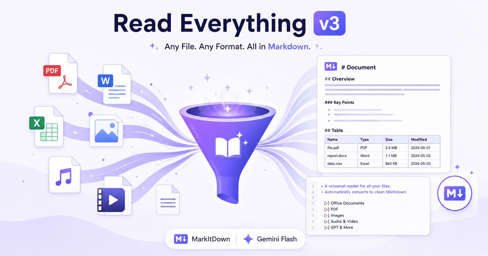

# <picture><source media="(prefers-color-scheme: dark)" srcset="assets/hero-dark.png"></picture>

**任何文件 → Markdown。干净、结构化、AI 就绪。**

Read Everything v3 将 PDF、Office 文档、图片、音频、视频转换为 Markdown 文件，保存在原文件旁边。不污染上下文，AI 按需读取。

[](LICENSE)
[](https://www.python.org/)
[]()
[]()

---

## 为什么选择 v3

| 痛点 | v3 方案 |
|------|---------|
| AI 读文件 → 全部倒进上下文 | 写入 `.md` 文件到原文旁边 — AI 只读需要的 |
| PDF 类型差异大（文字/工程图/扫描件） | 本地 VL 模型自动分类，走最优路线 |
| OCR 模型数字幻觉 | 交叉验证：2轮 → 差异 → 3轮 → 没有共识就不输出 |
| API 费用不可控 | 本地分类免费。Gemini Flash + NVIDIA NIM 免费。日常零成本 |

---

## 快速开始

### macOS / Linux

```bash
# 1. 安装系统依赖
brew install ollama       # macOS
# sudo apt install ollama # Linux

# 2. 拉取本地视觉模型（一次性，约 6GB）
ollama pull qwen2.5vl:7b

# 3. 安装 Python 依赖
pip install "markitdown[all]" pypdfium2 pypdf dashscope openai requests Pillow

# 4. 配置 API 密钥
cp scripts/read_everything_config.example.json scripts/read_everything_config.json
# 编辑 scripts/read_everything_config.json 填入真实密钥

# 5. 运行
python3 scripts/read_everything_v3.py document.pdf
# → document.pdf.md 已生成
```

### Docker

```bash
docker build -t read-everything-v3 .
docker run --rm -v $(pwd):/data -v $(pwd)/scripts/read_everything_config.json:/app/scripts/read_everything_config.json read-everything-v3 document.pdf
```

### Windows

```powershell
# 推荐使用 WSL2 或 Docker。本地 pip 方式：
pip install "markitdown[all]" pypdfium2 pypdf dashscope openai requests Pillow
python scripts\read_everything_v3.py document.pdf
```

#### 配置 API 密钥

将模板文件 `scripts/read_everything_config.example.json` 复制到 `~/.read_everything_config.json`，然后填入你的密钥：

```bash
cp scripts/read_everything_config.example.json ~/.read_everything_config.json
# 编辑 ~/.read_everything_config.json 填入真实 Key
```

> ⚠️ **绝不提交 `~/.read_everything_config.json` 到 GitHub。** 它已在 `.gitignore` 中拦截。模板文件不包含真实密钥。

---

## API 密钥（三个平台，全部免费）

| 平台 | 用途 | 免费额度 | 一键直达 |
|------|------|---------|---------|
| **Google AI Studio** | Gemini 2.5 Flash OCR（首选） | 1,500 次/天 | [🔗 获取 Key](https://aistudio.google.com/apikey) |
| **NVIDIA NIM** | Qwen3.5-397B OCR（备选） | 5,000 免费积分 | [🔗 获取 Key](https://build.nvidia.com) |
| **阿里云百炼 DashScope** | 语音转文字 qwen-asr | 100 万 token 试用 | [🔗 获取 Key](https://bailian.console.aliyun.com) |

> **三个平台都无需绑定信用卡。** 日常使用完全够用。

所有 Key 写入 `~/.read_everything_config.json`（在你的 home 目录下，不在仓库内 — **绝不提交 API 密钥**）。

---

## 支持格式

| 输入 | 引擎 | 输出 |
|------|------|------|
| `.pdf`（纯文字） | MarkItDown (pdfplumber) | 结构化 Markdown |
| `.pdf`（工程图纸） | Gemini Flash 交叉验证（3 轮） + 空间解读 | Markdown |
| `.pdf`（图文混合） | MarkItDown 文字层 + Gemini OCR 图片层合并 | Markdown |
| `.pdf`（扫描件） | Gemini Flash 交叉验证（3 轮） | Markdown |
| `.docx .pptx .xlsx .xls` | MarkItDown | Markdown |
| `.epub .html .csv .json .xml .ipynb .zip .msg` | MarkItDown | Markdown |
| `.jpg .jpeg .png .webp .bmp`（文档类） | Gemini Flash 交叉验证（3 轮） OCR | Markdown |
| `.jpg .jpeg .png`（实拍照片） | AI 描述（单轮） | Markdown |
| `.wav .mp3 .m4a .ogg .flac` | qwen-asr 云端 / whisper-cpp 本地 | 转写文本 |
| `.mp4 .mov .avi .mkv` | ffmpeg 提取音频 → whisper（仅提取音频转写） | 转写文本 |
| `.txt .md .json .csv .py` | 直接读取 | 原文 |

---

## 架构一览

```
输入文件
  │
  ├─ .docx/.pptx/.xlsx/.xls → MarkItDown ───────────────→ .md ✅
  ├─ .epub/.html/.csv/.json/... → MarkItDown ────────────→ .md ✅
  ├─ .wav/.mp3/.ogg → qwen-asr / whisper-cpp ────────────→ .md ✅
  ├─ .mp4/.mov → ffmpeg → whisper ───────────────────────→ .md ✅
  │
  ├─ .pdf → [qwen2.5vl:7b 本地 VL] 分类：
  │   ├─ TEXT（纯文字）: MarkItDown 直接提取 ──────────────→ .md ✅
  │   ├─ ENGINEERING（工程图）: Gemini Flash 交叉验证 + 空间解读 → .md ✅
  │   ├─ MIXED（图文混合）: MarkItDown 文字 + Gemini OCR 合并 → .md ✅
  │   └─ OTHER（扫描件）: 同 ENGINEERING ────────────────→ .md ✅
  │
  └─ .jpg/.png → [qwen2.5vl:7b 本地 VL] 分类：
      ├─ TEXT_IMAGE/POSTER: Gemini Flash ×2 轮 OCR ─────→ .md ✅
      ├─ PHOTO（实拍）: AI 描述 ─────────────────────────→ .md ✅
      └─ OTHER（艺术图）: 跳过 ──────────────────────────→ ∅
```

### 交叉验证引擎（非 TEXT 类型启用）

```
第 1 轮 + 第 2 轮 — 相同提示词，首选 Gemini Flash（失败则切 NVIDIA）
  ├─ 两轮一致 → 直接输出 ✅（实测大多数场景到此即通过）
  └─ 不一致 → 分析差异 → 优化提示词 → 第 3 轮
      ├─ 第 3 轮与某一轮一致 → 输出共识内容 ✅
      └─ 三轮各不同 → 输出并标注 ⚠️ 警告（极少发生）
```

> 两轮交叉验证在实际测试中准确率极高，第三轮作为兜底保障存在。

### PDF 分类

首页渲染 scale=1.2 → `qwen2.5vl:7b`（Ollama 本地，免费）→ 输出一个分类词。

| 分类 | 处理方式 |
|------|---------|
| `TEXT` | MarkItDown 提取文本层。不需大模型。 |
| `MIXED` | MarkItDown 文字 + 渲染页 → Gemini OCR 图片内容 → 合并 |
| `ENGINEERING` | 全部页面 → Gemini Flash OCR + 空间解读（网格坐标 → 尺寸区域 → 部件映射） |
| `OTHER` | 同 ENGINEERING（扫描件无文本层） |

---

## 依赖

| 依赖 | 用途 | 安装 |
|------|------|------|
| `markitdown` | Office/结构化文档转换 | `pip install "markitdown[all]"` |
| `pypdfium2` | PDF 渲染为图片 | `pip install pypdfium2` |
| `pypdf` | PDF 文本提取 | `pip install pypdf` |
| `ollama` | 本地 VL 模型服务 | `brew install ollama` (macOS) / [ollama.com](https://ollama.com) |
| `qwen2.5vl:7b` | PDF/图片分类 | `ollama pull qwen2.5vl:7b`（约 6GB） |
| `dashscope` | 语音转写 (qwen-asr) | `pip install dashscope` |
| `openai` | NVIDIA NIM API 兼容 | `pip install openai` |
| `requests` | Gemini API 调用 | `pip install requests` |

---

## 项目结构

```
read-everything-v3/
├── README.md                    # 本文
├── LICENSE                      # MIT
├── SECURITY.md                  # 安全漏洞报告
├── SUPPORT.md                   # 帮助 & 常见问题
├── CODE_OF_CONDUCT.md           # 社区行为准则
├── Dockerfile                   # 容器化部署
├── .gitignore                   # 凭证 & 系统文件保护
│
├── SKILL.md                     # Claude Code Skill 定义
│
├── scripts/
│   └── read_everything_v3.py    # 核心引擎（约 600 行）
│
├── references/
│   ├── architecture.md          # 完整架构规范
│   └── boundary-matrix.md       # 工具选择边界矩阵
│
└── assets/
    ├── hero.png                 # 封面图（浅色模式）
    └── hero-dark.png            # 封面图（深色模式）
```

---

## 路线图

- [x] PDF 四分类（TEXT / MIXED / ENGINEERING / OTHER）
- [x] 图片四分类（TEXT_IMAGE / POSTER / PHOTO / OTHER）
- [x] 交叉验证引擎（2 轮比对 → 必要时 3 轮兜底）
- [x] 工程图空间解读
- [x] 三层降级（Gemini Flash → NVIDIA NIM → 停止）
- [ ] 视频关键帧提取 + 画面视觉分析
- [ ] MCP Server 模式（模型上下文协议）
- [ ] 批量转换 + 进度条
- [ ] MarkItDown OCR 插件集成（markitdown-ocr）

---

## 常见问题

**问：开源到 GitHub 会不会泄漏我的 API Key？**
答：不会。所有 Key 从 `~/.read_everything_config.json` 读取 — 该文件在你的 home 目录，不在仓库内。`.gitignore` 已拦截所有凭证模式。可以安全地 push 到 GitHub。

**问：为什么用 MarkItDown + Gemini 而不是一个工具全搞定？**
答：MarkItDown 擅长结构化文档（Word/PPT/Excel/文字 PDF），100% 离线运行。Gemini 擅长视觉 OCR，近乎零错误率且免费。v3 分类器自动为每种文件选择最佳工具。

**问：Gemini 和 NVIDIA 同时挂了怎么办？**
答：v3 停止并告知你。不会降级到 DashScope（实测：26→25AWG 数字识别错误，工业领域不可接受）。

**问：工程图 OCR 准确率怎么样？**
答：交叉验证（2 轮）在测试样本上实现 100% 字段准确率。26AWG、394±1、L7GCP014-DT-R — 全部通过多轮交叉验证。

---

## 参与贡献

欢迎贡献！详见 [GitHub Issues](https://github.com/Ming-Sir-69/read-everything-v3/issues) 和 [CODE_OF_CONDUCT](CODE_OF_CONDUCT.md)。

## 致谢

本项目受到 [**Microsoft MarkItDown**](https://github.com/microsoft/markitdown)（2026 年 6 月由微软 AutoGen 团队推出）的启发，将其作为核心文档转换引擎。

| 参考项目 | 用途 | 链接 |
|---------|------|------|
| **Microsoft MarkItDown** | Office 文档 / 结构化格式 → Markdown 转换引擎 | [github.com/microsoft/markitdown](https://github.com/microsoft/markitdown) |
| **Ollama** | 本地视觉模型服务（qwen2.5vl 分类） | [ollama.com](https://ollama.com) |
| **Google Gemini** | 首选云端 OCR（Gemini 2.5 Flash） | [aistudio.google.com](https://aistudio.google.com) |
| **NVIDIA NIM** | 备选云端 OCR（Qwen3.5-397B） | [build.nvidia.com](https://build.nvidia.com) |

## 许可证

[MIT](LICENSE) © 2026 Eric Mingle ([Ming-Sir-69](https://github.com/Ming-Sir-69))
